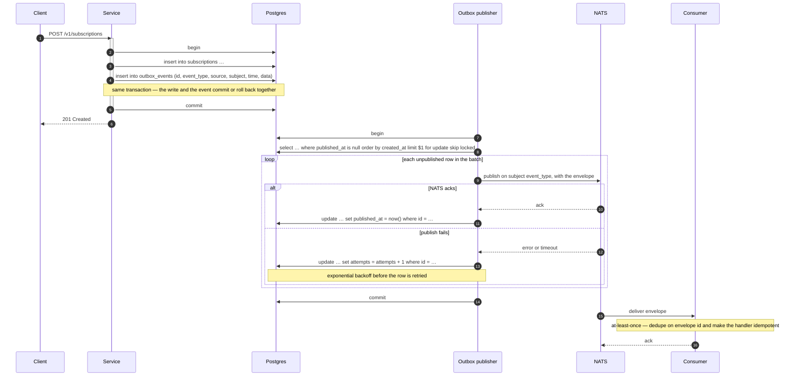

# Event outbox

How a cafaye service turns a committed database write into a published event
without lying about either. The envelope it publishes is the one in
[event-naming.md](event-naming.md); this document is about the part between
`COMMIT` and `PUBLISH`.

## The problem

A domain write and its event must not be able to disagree. Both of these are
real, both have shipped, and neither is acceptable in a system where billing
depends on identity:

- **Publish first, then write.** The event is on the bus and a consumer has
  acted on it, then the transaction rolls back. The state change never happened.
- **Write first, then publish.** The transaction commits and the process is
  killed, OOM-killed, or throws on the publish, before the message reaches NATS.
  The state changed and nobody was told.

The fix is not a retry loop around a publish call. It is one table, written in
the same transaction as the domain row.

## The rule

**A service never publishes an event outside a transaction that also wrote the
domain state it describes.** The event goes into `outbox_events` in that
transaction; a separate publisher loop moves rows from the table to NATS. If the
write rolls back, the event never existed. If the process dies, the row is still
there.

Publishing *after* commit from an in-memory queue — an atexit flush, a channel
fed inside the handler — is the same bug with a nicer syntax.

## The table

One table, in the publishing service's own database, in its own migration. The
column list is the contract; the implementation is the service's business.

```sql
create table if not exists outbox_events (
  id           uuid        primary key,
  event_type   text        not null,
  source       text        not null,
  subject      text        not null,
  time         timestamptz not null,
  data         jsonb       not null,
  created_at   timestamptz not null default now(),
  published_at timestamptz null,
  attempts     int         not null default 0
);

-- The publisher's only query. Without this it is a sequential scan of every
-- event the service has ever published, forever.
create index if not exists outbox_events_unpublished_idx
  on outbox_events (created_at)
  where published_at is null;
```

| Column | Rule |
| --- | --- |
| `id` | The envelope's `id`, generated before the insert. The row and the message carry one identity, so a retry publishes the same `id` and the consumer's dedupe key actually dedupes. |
| `event_type` | The `type` from [event-naming.md](event-naming.md#grammar), and the NATS subject this row is published to. No mapping table, no prefix rewriting. |
| `source` | The publishing service, equal to the envelope's `source` and the manifest's `name`. |
| `subject` | Required, `platform` for an entity-less event. The column is `not null` because the envelope field is. |
| `time` | When the state change happened, not when the row was inserted or published. A row that sat unpublished for an hour still reports the original time. |
| `data` | The payload, exactly as the envelope's `data`. Validated against `schemas/events/<type>.schema.json` before the insert. |
| `created_at` | Insert time. The publisher's ordering key, so a slow batch cannot publish event 2 before event 1. |
| `published_at` | `null` until NATS acknowledges. This is the only definition of "published" — not "attempted", not "handed to a client". |
| `attempts` | Publish attempts so far. Incremented on failure; it is the input to backoff and the signal that alerts on. |

`jsonb` and not `json`: `jsonb` is parsed, so a contract test or a query can
reach inside the payload, and it normalises key order so two identical payloads
are byte-identical.

## The publisher loop

A separate process, or a goroutine/fiber/task in the service's worker — not the
request path. It never sleeps on behalf of a request.

```sql
begin;

select id, event_type, source, subject, time, data
  from outbox_events
 where published_at is null
 order by created_at
 limit $1
   for update skip locked;

-- publish each row to NATS on the subject event_type, then per row:
--   on ack:    update outbox_events set published_at = now() where id = $1
--   on failure: update outbox_events set attempts = attempts + 1 where id = $1

commit;
```

- **`for update skip locked`** is what lets N replicas run this loop against one
  table. A row already claimed by another publisher is skipped, not blocked on,
  so a slow batch in one replica cannot stall the rest.
- **Ack, then mark.** `published_at` is set from the NATS ack, never before. A
  publish that was never acknowledged is an unpublished row, and the next pass
  republishes it — same `id`, so a consumer that already got it ignores the
  duplicate.
- **`attempts` grows, the wait grows with it.** Exponential backoff on
  `attempts` — 1s, 2s, 4s, … capped at a few minutes — so a broker outage does
  not turn into a hot loop against a broker that is already down. Cap the
  attempts too: past the cap, alert and leave the row alone. An event stuck for
  an hour is an incident; an event dropped silently is a mystery.
- **The transaction is short.** Claim the batch, publish, mark, commit. Holding
  row locks across a network call is what turns a broker hiccup into a database
  one, and the rows stay unpublished — which is correct, but the whole table
  stops moving while it happens.
- **A batch, not a row.** One round trip per event does not survive a service
  that emits thousands of them. Claim a batch (100–500 rows), publish them in
  order, mark them in one statement per row.
- **Ordering is per-`subject`, not global.** Two events about the same entity
  are published in `created_at` order by the same loop. Two events about
  different entities are unordered, and consumers must not assume otherwise.

## The sequence



The gap between `201 Created` and the delivery is not a bug, it is the design:
the client is told the write committed, and the event is guaranteed to follow.
What is *not* guaranteed is that it follows exactly once.

## At-least-once, so idempotent

The outbox guarantees **at-least-once** delivery, and it cannot promise more
without a distributed transaction between the service's database and the broker.
Every duplicate source is ordinary operation, not failure:

- the publisher commits, then the process dies before it acks, so the row is
  republished;
- NATS acks, then the mark-`published_at` statement fails, so the row is
  republished;
- a consumer's handler commits its work, then the ack back to NATS is lost, so
  the message is redelivered.

So: **a consumer that is not idempotent is broken, and it will not fail in
testing.** The rules that make it idempotent:

1. **Dedupe on `id`.** Store the envelope `id` in a table with a unique
   constraint and insert it in the same transaction as the handler's own work.
   A duplicate insert is a duplicate delivery, and the handler returns without
   doing anything twice. The unique constraint is the whole mechanism — an
   in-memory "have I seen this?" set is wrong the moment there are two replicas.
2. **Never treat a redelivery as new information.** Log it, count it, move on.
   An at-least-once bus makes duplicate counts a health metric, not an alert
   condition — a rising duplicate rate means the publisher is struggling, and
   the metric is how you find out before the queue does.
3. **Order by `subject`, not by arrival.** Two events about one entity arrive in
   `created_at` order from the same publisher, but a redelivery can arrive late
   and out of sequence. Correlate on `subject` and compare `time` before acting
   on anything that is order-dependent.
4. **Handlers are small and side-effect-free outside the transaction.** A handler
   that emails, charges a card, or calls a third party *inside* its transaction
   cannot be rolled back, so a redelivery repeats it. Write the intent to your
   own database in the transaction and let an idempotent worker do the outside
   work from there.

## Per-service implementations, never shared code

Each service implements this in its own language, in its own repository, in its
own migration. There is no shared outbox library, and there will not be one.
An outbox loop is a few dozen lines of SQL plus a publish loop — small, and
surrounded by decisions that belong to the service: batch size, backoff ceiling,
where the publisher runs, what the alerts look like, how retention works. A
shared library would have to expose every one of those as configuration, and
would end up owning the transaction semantics of six different ORMs.

What core owns is the contract: this table, the loop's shape, and the guarantee
it makes. Everything else is the service's.

## Retention

`published_at is not null` means the row is spent. Retention is a service's
call, and it is a real one: an outbox nobody prunes is the largest table in the
database and the reason someone eventually deletes rows that were never
published.

- Delete in batches, on a schedule, with the same `for update skip locked`
  discipline the publisher uses, so retention never contends with publishing.
- Keep at least as long as the slowest consumer's redelivery window, plus the
  longest plausible consumer outage. Zero retention is only safe for a service
  whose consumers are all in-process.
- Rows that have never published are **not** retention material. They are an
  incident: alert on `attempts` and on the age of the oldest unpublished row.

## Checklist for a new event

- [ ] Inserted into `outbox_events` in the same transaction as the domain write.
- [ ] `id` generated before the insert and reused on every retry.
- [ ] `data` validated against `schemas/events/<type>.schema.json` before the insert.
- [ ] Publisher loop running for the service, with backoff and an attempt cap.
- [ ] Every consumer of the type dedupes on `id` with a unique constraint.
- [ ] An alert on the oldest unpublished row and on `attempts`.
- [ ] Retention scheduled, batched, and long enough for the slowest consumer.
